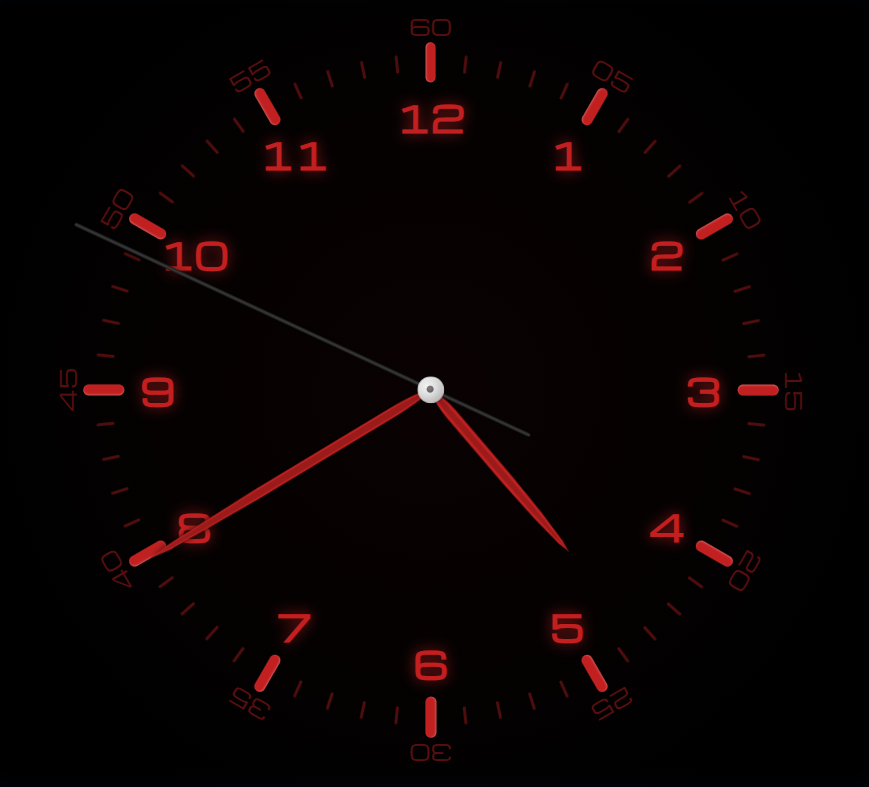

# Clock Screensaver



## Getting Started

To get a local copy up and running, follow these simple steps.

### Prerequisites

You need to have Node.js and npm installed on your system.

### Installation

1. Clone the repo
   ```sh
   git clone https://github.com/your_username/clock-screensaver.git
   ```
2. Install NPM packages
   ```sh
   npm install
   ```

## Usage

To start the screensaver, run the following command:

```sh
npm start
```

To open the settings, run:

```sh
npm run settings
```

## Building

To build a portable version of the screensaver, run:

```sh
npm run build
```

To build an installer for Windows, run:

```sh
npm run build:installer
```

## License

Distributed under the ISC License. See `LICENSE` for more information.
